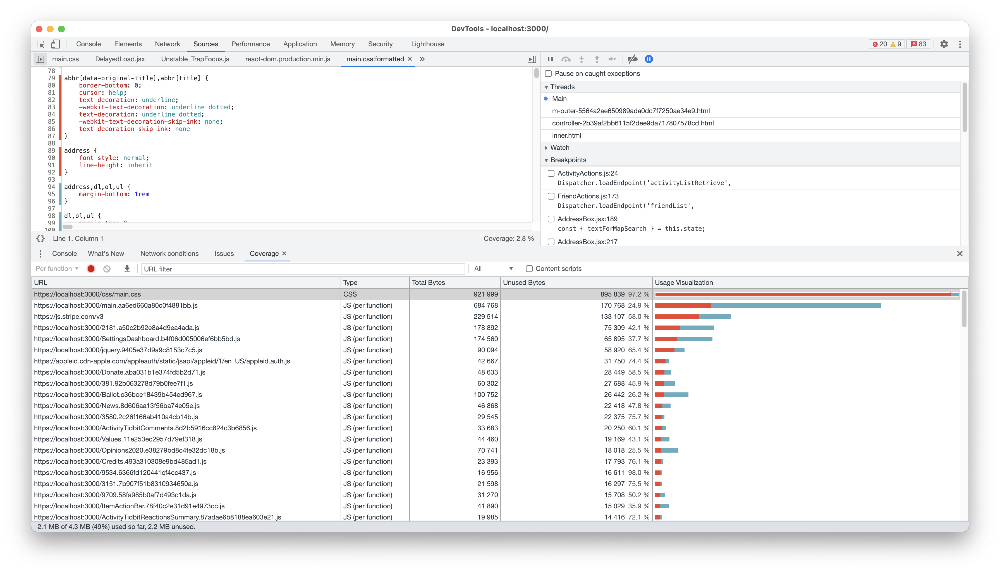

# Lighthouse Performance Testing
* Make sure all logging is set to false in config.js
* If you have a choice, use the API server instead of a local instance
* Performance will be better with the production server, since some requests will be served from
the CDN, and http responses will be compressed.

#### Detect and remove unused CSS

This is a risky one -- it relies on you manually navigating the app through every page,
and every popup.  It has a built in coverage analyzer that shows each chunk
and what percentage of its contents are unused.  It also shows for main.css which lines are not used (as of July 1, 2021 about 97% of the css is not used, and all the loading and processing of main.css occurs before anything renders at app startup.)

Some of the css only gets used if in mobile mode, so that has to be a part of a coverage run.

https://web.dev/unused-css-rules/?utm_source=lighthouse&utm_medium=devtools




### General 


In general the goal is to make the main chunk as small as possible, any other chunks beyond what is
automatically generated by WebPack don't save much runtime, and greatly slow down compile time.

Be sure to label any new chunks you make via lazy loading...
```
const About = React.lazy(() => import(/* webpackChunkName: 'About' */ './js/routes/More/About'));
```
Make a minimum sized build using the "prod" script.  Keep in mind that the "prod" script will
decrease the size of the chunks by about 2/3.

```
npm run prod
node server-prod-local.js
```

